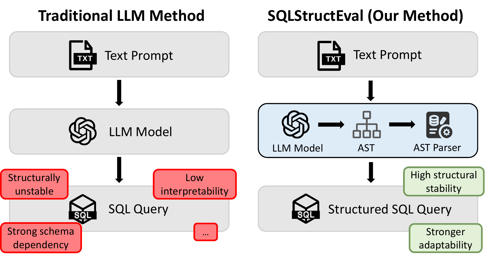

<div align="center">

<h1>SQLStructEval</h1>

<h3>Structural Evaluation of LLM Text-to-SQL Generation</h3>

<p>
  Yixi Zhou<sup>*</sup>, Fan Zhang<sup>*</sup>, Zhiqiao Guo<sup>*</sup>,
  Yu Chen<sup>†</sup>, Haipeng Zhang<sup>†</sup>, Preslav Nakov, and Zhuohan Xie
</p>

<p><sup>*</sup> Equal contribution &nbsp; · &nbsp; <sup>†</sup> Corresponding authors</p>

<p>
  
  <a href="https://arxiv.org/abs/2604.06736"></a>
  <a href="https://xanderzhou2022.github.io/AACL2026-SQLSTRUCTEVAL/assets/sqlstructeval-paper.pdf"></a>
  <a href="https://xanderzhou2022.github.io/AACL2026-SQLSTRUCTEVAL/"></a>
</p>

<p><strong>SQLStructEval evaluates how consistently language models construct SQL across repeated generations and equivalent inputs, alongside execution accuracy.</strong></p>

<p>
  
</p>

</div>

## Overview

SQLStructEval examines how consistently language models construct SQL across repeated generations and equivalent presentations of the input. It canonicalizes SQL with `sqlglot`, then measures structural concentration, diversity, reference alignment, and sensitivity to question and schema perturbations alongside execution accuracy.

**Different structures are not inherently errors.** These measures are diagnostic: they reveal variation for further semantic or downstream inspection. A query can agree with the reference on one database without being equivalent on every possible database.

- **Repeated generation:** compare canonical structures for the same question and schema.
- **Execution and structure:** inspect both all outputs and the execution-correct subset.
- **Compile-style generation:** generate a JSON query plan, then deterministically compile it into SQL.
- **Input perturbations:** compare majority structures across paraphrases and reordered schemas.

## Paper results

On 1,034 Spider development questions, with ten GPT-5-mini generations per question:

| Measure | Direct SQL | DIN-SQL | Compile-style |
| --- | ---: | ---: | ---: |
| Execution accuracy | 0.742 | 0.736 | **0.785** |
| AST agreement among correct outputs | 0.552 | 0.579 | **0.632** |
| Distinct structures across all outputs | 1.908 | 1.553 | 2.527 |

Values are transcribed from the paper's full-pipeline comparison, not regenerated by this release. The comparison does not isolate the effects of the representation, compiler, or prompting. Diversity across all outputs and concentration among correct outputs describe different distributions.

The paper evaluates seven models on Spider and includes scope checks on 100-example subsets of BIRD Mini-Dev, Spider-Syn, and Dr.Spider. This repository releases the supplied core implementation; dataset-specific scope-check scripts, sampled outputs, original model-client implementations, the DIN-SQL baseline, and manually checked paraphrases were not included in the source archive. Exact table reproduction requires those artifacts and the original environment.

## Repository layout

```text
core/                  Canonicalization, metrics, JSON-to-SQL compiler, API adapter
experiments/exp1/      Repeated direct SQL generation
experiments/exp2/      Execution vs. structure analysis
experiments/exp3/      Compile-style generation and error-analysis tools
experiments/exp4/      Paraphrase / schema generation and robustness analysis
scripts/               Spider input preparation and combined metrics runner
examples/              Synthetic offline demo
tests/                 Release regression checks
docs/                  Experiment guide and release notes
```

The **`main` branch** contains code and documentation. The independent **`gh-pages` branch** contains the project website, figures, and paper PDF. GitHub Pages should publish from **`gh-pages` / `(root)`**.

[Experiment guide](docs/EXPERIMENTS.md) · [Release notes](docs/RELEASE_NOTES.md)

## Quick start: no API key needed

Python **3.10+** is required. Run commands from the repository root:

```bash
python3 -m venv .venv
source .venv/bin/activate
pip install -r requirements.txt
python -m examples.offline_demo
python -m unittest discover -s tests -v
```

The synthetic demo compiles a query and compares two SQL formulations on a temporary SQLite database. Expected output includes execution accuracy `1.0`, two distinct correct structures, and correct-subset majority `0.5`. It does not download data or contact an API.

## Generate with an API

```bash
pip install -r requirements-api.txt
cp .env.example .env
# Edit .env locally, filling OPENAI_API_KEY, then load it:
source .env
```

The optional adapter uses the OpenAI Chat Completions interface. Set `OPENAI_BASE_URL` only for an endpoint you intend to send your questions and schemas to. Other providers can use a wrapper implementing the `ChatClient` protocol exposed by the generation modules. The included adapter issues independent single-completion requests.

For a model that rejects temperature, set `STRUCTEVAL_OMIT_TEMPERATURE=1` in `.env`. This is explicit, and recorded in generation metadata; the adapter never silently retries with changed decoding settings. Availability of the paper's model snapshots depends on your provider.

Prepare official Spider data locally, then generate a small initial run:

```bash
python -m scripts.prepare_spider \
  --dev_file data/spider/dev.json \
  --tables_file data/spider/tables.json \
  --output_file data/dev_structeval.json

python -m experiments.exp1.run_experiment1_text2sql \
  --dev_file data/dev_structeval.json \
  --output_file outputs/direct.jsonl \
  --model_name gpt-5-mini-2025-08-07 \
  --max_examples 5 --num_generations 10

python -m experiments.exp2.run_experiment2_exec_vs_structure \
  --generations_file outputs/direct.jsonl \
  --db_root data/spider/database \
  --stats_out outputs/direct_stats.jsonl \
  --summary_out outputs/direct_summary.json
```

See [the experiment guide](docs/EXPERIMENTS.md) for the remaining experiments, input schemas, and metric conventions. Generation creates a new output file exclusively; use a different filename to preserve a previous run.

## Evaluation conventions and limits

- `AST Sim (corr)` is majority concentration among parsed execution-correct outputs, not tree-edit similarity.
- Empty structural subsets receive zero in the supplied within-question metrics. Dataset averages therefore also reflect parse coverage.
- `execution_accuracy_on_exec_success` is conditional accuracy, not the proportion of error-free executions.
- `high_acc_low_struct` uses accuracy ≥ 0.8 and more than one correct structure; `exec_correct_and_struct_diff` uses at least two execution-correct outputs and agreement < 0.7, including missing agreement represented as zero.
- Perturbation analysis compares per-input majority structures; its empty-input convention is documented in the experiment guide.
- Canonicalization is not a semantic-equivalence checker. The inherited normalizer lowercases string literals and has limited alias-scope handling. The executor compares normalized result rows; it is not the official Spider test-suite evaluator and does not assess every SQL semantic distinction.

Read [release notes](docs/RELEASE_NOTES.md) before comparing a rerun with the paper: compatibility and database-protection fixes can affect parse coverage and metrics.

## Data and credentials

Download benchmark data from the [official Spider project](https://yale-lily.github.io/spider), following its licensing terms. Benchmark datasets and generated outputs are excluded from this repository. Keep credentials in environment variables or an ignored local `.env`; do not commit them. Evaluation opens local benchmark databases read-only and rejects over-limit result sets rather than comparing truncated prefixes.

## Citation

The paper is accepted at AACL 2026. Bibliographic metadata below is provisional until the final proceedings entry is available.

```bibtex
@inproceedings{zhou2026sqlstructeval,
  title = {{SQLStructEval}: Structural Evaluation of LLM Text-to-SQL Generation},
  author = {Zhou, Yixi and Zhang, Fan and Guo, Zhiqiao and Chen, Yu and
            Zhang, Haipeng and Nakov, Preslav and Xie, Zhuohan},
  booktitle = {AACL},
  year = {2026},
  address = {Hengqin, China},
  note = {Accepted; proceedings metadata forthcoming},
  url = {https://arxiv.org/abs/2604.06736}
}
```

## License

Code is released under the [MIT License](LICENSE). Benchmark data and the paper retain their respective rights and licensing terms.
